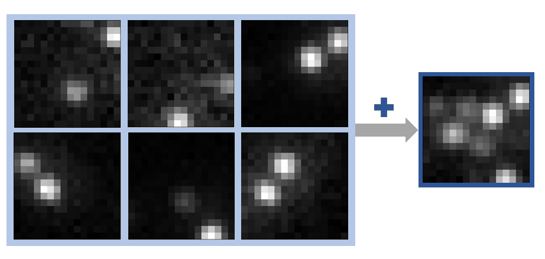

[](https://zenodo.org/badge/latestdoi/363403124)
# ImageSumming
Workflow addon for [DeepSTORM2D](https://github.com/HenriquesLab/ZeroCostDL4Mic) to train with experimental data. </br>

This includes summation of random patches of low density emitter movies and respective localization lists to high density emitter files,
the evaluation of prediction and ground truth localizations, and helpful further add-ons.



## How to install
```
conda create --name ImageSumming
conda activate ImageSumming
cd path_to_file
conda install pip
pip install ImageSumming-XXXXX-py3-none-any.whl
```

## How to run
```
conda activate ImageSumming
cd path_to_notebooks
jupyter notebook
```
Give the analysis a try with the test files in the [dataset folder](https://github.com/JohannaRahm/ImageSumming/tree/master/dataset), 
including a DNA-PAINT movie and corresponding localization file (in DeepSTORM2D format).
For more details follow the [manual](https://github.com/JohannaRahm/ImageSumming/blob/master/ImageSumming_manual.pdf).

## Compatibility
ImageSumming is compatible with Picasso and DeepSTORM2D localization files. In general other localization softwares can be used as 
ground truth as long as the localization list is in csv format and contains the comma separated columns "frame", "x [nm]", and "y [nm]". 

## Citation
Please reference our paper when using ImageSumming. </br>

K. K. Narayanasamy, J. V. Rahm, S. Tourani, M. Heilemann, Fast DNA-PAINT imaging using a deep neural network, Nat. Comm, 13, 5047, 2022, DOI: [10.1038/s41467-022-32626-0](https://doi.org/10.1038/s41467-022-32626-0)

The data and trained model of the study are available [here](https://zenodo.org/record/6966132).

## Literature
E. Nehme, L. E. Weiss, T. Michaeli, Y. Shechtman, Deep-STORM: super-resolution single-molecule microscopy by deep
learning, Optica, 2018, 5, 458-464, DOI: [10.1364/OPTICA.5.000458](https://doi.org/10.1364/OPTICA.5.000458)

L. Chamier, R. F. Laine, J. Jukkala, C. Spahn, D. Krentzel, E. Nehme, M. Lerche, S. Herández-Pérez, P. K. Mattila,
E. Karinou, S. Holden, A. C. Solak, A. Krull, T.-O. Buchholz, M. L. Jones, L. Royer, C. Leterrier, Y. Shechtman, F. Jug,
M. Heilemann, G. Jacquemet, R. Henriques, Democratising deep learning for microscopy with ZeroCostDL4Mic,
Nature Communications, 2021, 12:2276, DOI: [10.1038/s41467-021-22518-0](https://doi.org/10.1038/s41467-021-22518-0) 

## About authors
For more information about the authors visit https://www.uni-frankfurt.de/43273046/People

